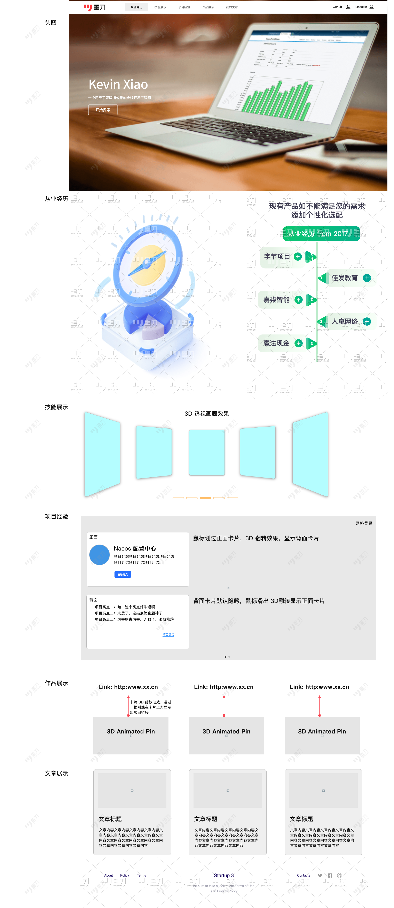

# 个人网站项目

## 一、项目介绍

> 个人网站项目是一个基于 React 框架的单页应用，用于展示个人的项目、技能、经验和联系信息，增加用户互动和展示个人品牌，最终提升远程求职的竞争力和被动求职。

## 二、项目计划

#### 2.1 OKR：

2026 年 1 月底上线 V1.0 版本，包括项目展示、技能展示、经验展示和联系信息展示等功能。

#### 2.2 目标拆解-总览

| 阶段       | 周次    | 重点任务          | 核心产出             |
| ---------- | ------- | ----------------- | -------------------- |
| 规划与设计 | 第 1 周 | 极速规划+设计定稿 | 设计稿、技术栈确定   |
| 核心搭建   | 第 2 周 | 基础框架+核心组件 | 项目骨架、主视觉完成 |
| 功能开发   | 第 3 周 | 关键模块实现      | 简历、项目展示功能   |
| 功能开发   | 第 4 周 | 深度功能+内容填充 | 交互功能、内容初稿   |
| 优化打磨   | 第 5 周 | 性能优化+多端适配 | 性能报告、响应式完成 |
| 最终测试   | 第 6 周 | 测试调试+SEO 优化 | 测试报告、上线准备   |
| 上线部署   | 第 7 周 | 部署上线+推广准备 | 网站上线、求职材料   |

#### 2.3 目标拆解-详细

##### 第 1 周（12 月第 1 周）：极速规划与设计冲刺

目标：确定方向，完成设计稿，明确技术栈

**任务分解**

- 分析 3-5 个最优秀的开发者个人网站，记录亮点
  - 优秀网站参考：https://www.awwwards.com/
- 配色参考：
  - Pinterest：https://www.pinterest.com/
- 网站动效参考：
  - https://monolithstudio.com/
  - Frame Motion: https://www.framer.com/motion/
- 素材收集库：https://artinnovationgallery.com/
- 效果好的组件库：
  - Magic UI: https://magicui.design/
  - Aceternity UI: https://ui.aceternity.com/
  - Cult UI: https://www.cult-ui.com/
- 网站导航：根据分析结果，选择一个核心导航方案（如：顶部导航、侧边导航、面包屑导航）
- 确定网站核心结构（必须：首页、项目展示、简历；可选：博客）
- 使用 Figma/Canva 制作关键页面线框图（首页、项目详情页）
- 确定技术栈，创建项目仓库，完成基础配置

**技术栈推荐（快速出活组合）：**

- 框架：Next.js 16 + TypeScript（SSR/SEO 友好）
- 样式：Tailwind CSS + Framer Motion（动效）
- 部署：Vercel（自动部署）
- 亮点库：根据方向选择 1 个即可（Three.js / D3.js / 粒子动画库）

**产出：** 设计稿、技术决策文档、GitHub 仓库初始化

## 三、展示模块

- 从业经历：展示工作经历，包括工作经历名称、工作经历描述、工作经历时间等。
- 技能展示：展示个人的技能，包括技能名称、技能等级、技能描述等。
- 项目展示：展示个人的项目，包括项目名称、项目描述、项目技术栈、项目链接等。
- 作品展示：展示个人的作品，包括作品名称、作品描述、作品技术栈、作品链接等。
- 写作展示：展示个人的写作，包括写作名称、写作描述、写作链接等。
- 联系信息展示：展示个人的联系信息，包括邮箱、手机号、社交媒体账号等。

#### 3.1 展示模块布局

- 首页：展示个人的基本信息、导航菜单、联系信息等。
- 技能展示页：展示个人的技能，包括技能名称、技能等级、技能描述等。
  - 灵感 1：墙壁板子展示技能，点击弹出技能详情。
  - 灵感 2：书本翻页展示技能，点击翻页切换。
  - 灵感 3：3D 画廊环绕展示技能，左右滑动切换卡片，点击放大。
- 项目展示页：展示个人的项目，包括项目名称、项目描述、项目技术栈、项目链接等。
- 作品展示页：展示个人的作品，包括作品名称、作品描述、作品技术栈、作品链接等。
- 写作展示页：展示个人的写作，包括写作名称、写作描述、写作链接等。
- 联系信息页：展示个人的联系信息，包括邮箱、手机号、社交媒体账号等。

## 四、项目技术栈

- 前端：React、React Router、Ant Design
- 后端：Node.js、Koa/Nest.js
- 数据库：MongoDB
- 部署：AWS EC2、Nginx

## 五、项目代办

- [ x ] 项目灵感收集：收集心仪的风格、配色、设计、功能点等灵感。
- [ x ] 项目风格设计：配色
- [ x ] 项目页面原型设计
- [ x ] 项目初始化：创建项目仓库，完成基础配置。
- [ ] 头图键盘动效和 Keven Xiao 的关联和强化
- [ ] 从业经历时钟换成日历，和时间轴 Hover 产品交互
- [ ] 网站真实数据替换
- [ ] 网站添加图片
- [ ] SEO，百度、谷歌搜索引擎优化
- [ ] 个人介绍模块：丰富你的形象，包括个人介绍、个人爱好、个人经历等。

## 六、独立项目 Idea

动效：卡片 3D 动效、Hover 动效、粒子效果、视差滚动
元素：Code

## 七、组件库可用的组件

- 从业经历时间线：https://ui.aceternity.com/components/timeline
- 3D 卡片效果：https://ui.aceternity.com/components/3d-card-effect
- 晃动卡片：https://ui.aceternity.com/components/wobble-card
- 其他作品图片展示效果：https://ui.aceternity.com/components/animated-testimonials
- 3D 引脚效果(展示作品和连接)：https://ui.aceternity.com/components/3d-pin

## 八、AI 提示词

需求：帮我开发一个前端开发工程师的个人网站，这个网站需要支持手机端访问也就是响应式。

页面和模块：总共一个页面，按照顺序有几个模块：header 导航，头图，从业经历，技能展示，项目经验，作品展示，我的文章，个人介绍，footer 网站信息。

技术栈：Next.js 16 + TypeScript + Tailwind CSS + Framer Motion。

网站需要具备的效果：丰富的动效，页面滚动时需要有视差滚动效果，模块需要有入场和出场动效，元素需要有 hover 效果。

网站风格：简洁大气；配色：主色#FB923C，网站整体是科技暗黑风格的。

模块布局文字描述：

1. 头图：需要设计一个通栏涵盖 header 的网格线背景，左侧是个人基本信息介绍，右侧是一个 3D 键盘浮动的效果，鼠标 hover 到键盘的某个按键上，按键会有被按下敲击的效果，鼠标离开则恢复。
2. 从业经历：左侧是一个 3D 的时钟效果，时钟的指针会一圈一圈的旋转，大概占据一半宽度，右侧是一个酷炫的时间轴用来显示过往工作的公司。
3. 技能展示：总共放 5 个技能卡片，卡片的样式和相框差不多，卡片内容是：技能名称，技能介绍，熟练度和进度条。动效是可以左右滑动切换的 3D 画廊效果，有透视的感觉哦。
4. 项目经验：这个模块有个流星划过的粒子动效作为模块大背景，放 6 个卡片展示项目经验，正面：左侧显示项目的效果图头像，右侧显示项目名称和项目介绍，背面：3 - 5 条的项目亮点。卡片支持鼠标划过 3D 翻转查看背面。
5. 作品展示：横向放置 3 个横向的长方形卡片，每个卡片显示作品名称和作品介绍，鼠标划过，卡片 3D 缩放带有透视的动效，卡片上方展示一根引线，引线上方显示出项目链接。
6. 文章展示：横向放置 5 个竖向的长方形的卡片，卡片内上部是文章封面图，下部是文章标题和文章概要。动效：鼠标划过卡片会跟随鼠标 3D 晃动的效果。
7. header: 无背景底色，左侧是作者姓名和几个模块的导航，右侧是 GitHub 和领英的图标。header 固定在顶部。
8. 个人介绍：左右布局，左侧：一张竖向长方形卡片，卡片内上面是个人头像，下面是个人基本信息：姓名、职业、年龄、学历、电话、微信、邮箱；右侧：上下布局：上面是个人介绍，下面是个人业务爱好的图片展示，每个图片是堆叠在一起的，每次点击切换图片底层的图片都会旋转一点角度，堆叠图片的右侧是文字信息，如图片标题和副标题，图片的介绍。
9. footer: 底部居中显示网站的备案号和作者姓名，换行显示
   GitHub 和领英的图标，右侧浮动显示一个小火箭返回顶部
   邮箱：邮箱的图标和邮箱地址，点击可以复制邮箱地址。

原型图：

